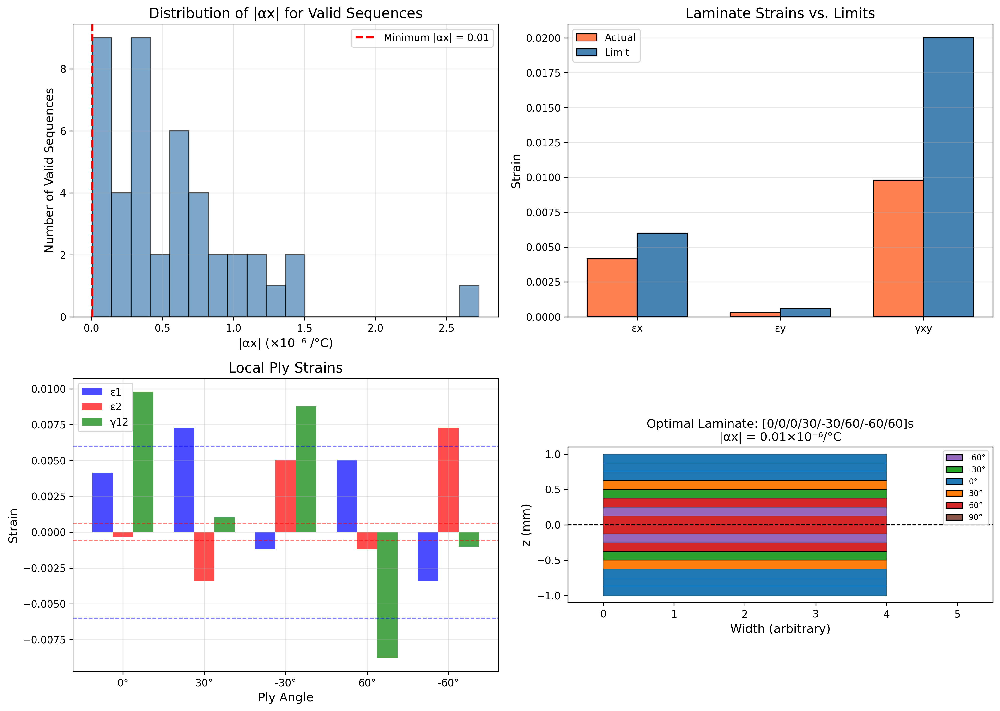

# STP 604E - Assignment 3 Results
## Failure Analysis and Laminate Design

**Course**: STP 604E - Advanced Design, Analysis and Optimization of Composite Structures for Aerospace
**Institution**: Istanbul Technical University - Defence Technologies
**Date**: January 2026
**Prepared by**: Giray Yillikci

---

## Table of Contents
1. [Problem 1: Strength Envelope](#problem-1)
2. [Problem 2: Stacking Sequence Identification](#problem-2)
3. [Problem 3: Unsymmetric Laminate Analysis](#problem-3)
4. [Problem 4: 16-ply Laminate Design](#problem-4)

---

## Problem 1: Strength Envelope using Maximum Strain Criterion {#problem-1}

### Problem Statement
A Graphite/Epoxy laminate with [0/±45₂/90]s stacking sequence is loaded only by biaxial loads. Draw the strength envelope for the laminate in the σ̄x - σ̄y plane using the maximum strain criterion. Determine the maximum value of:
- (a) Pure tensile load (Nx)
- (b) Pure compressive load (Ny)

### Material Properties

**Material**: Graphite/Epoxy

| Property | Value | Unit |
|----------|-------|------|
| E₁ | 138 | GPa |
| E₂ | 8.69 | GPa |
| G₁₂ | 7.10 | GPa |
| ν₁₂ | 0.3 | - |
| t | 0.125 | mm |

**Strength Properties**:

| Property | Value (MPa) |
|----------|-------------|
| Xₜ | 2280 |
| Xc | 1725 |
| Yₜ | 57 |
| Yc | 228 |
| S | 76 |

### Laminate Configuration

- **Stacking Sequence**: [0/±45₂/90]s = [0/45/45/-45/-45/90/90/-45/-45/45/45/0]
- **Number of Plies**: 12
- **Total Thickness**: 1.5 mm

### Ultimate Strains (for Maximum Strain Criterion)

| Strain | Value |
|--------|-------|
| ε₁ₜ | 0.01652 |
| ε₁c | 0.01250 |
| ε₂ₜ | 0.00656 |
| ε₂c | 0.02624 |
| γ₁₂_ult | 0.01070 |

### A-Matrix (Extensional Stiffness) [N/mm]

```
[[82174.0  32403.4      0.0]
 [32403.4  82174.0      0.0]
 [    0.0      0.0  35570.6]]
```

Note: A₁₆ = A₂₆ = 0 confirms balanced laminate (no shear-extension coupling)

### Results

#### (a) Maximum Pure Tensile Load (Nx)

| Parameter | Value |
|-----------|-------|
| Maximum σ̄x (tensile) | **303.46 MPa** |
| Maximum Nx | **455.19 N/mm** |
| Critical Ply | Ply 6 (90°) |
| Failure Mode | **Matrix Tension** |

At failure, the 90° ply reaches the transverse tensile strain limit (ε₂ = 0.00656).

#### (b) Maximum Pure Compressive Load (Ny)

| Parameter | Value |
|-----------|-------|
| Maximum σ̄y (compressive) | **-355.17 MPa** |
| Maximum Ny | **-532.76 N/mm** |
| Critical Ply | Ply 2 (45°) |
| Failure Mode | **Shear** |

At failure, the ±45° plies reach the shear strain limit (γ₁₂ = 0.01070).

### Strength Envelope


**Figure 1**: (Left) Strength envelope in σ̄x - σ̄y plane using maximum strain criterion. (Right) Laminate stacking sequence visualization.

### Key Observations

1. The laminate is **quasi-isotropic in tension** (same strength in x and y for tension)
2. **Matrix tension** controls failure under tensile loading due to low Yₜ
3. **Shear failure** controls under compression due to the ±45° plies
4. The envelope is symmetric about the origin due to the balanced symmetric layup

---

## Problem 2: Stacking Sequence Identification from Experiments {#problem-2}

### Problem Statement
Determine the laminate stacking sequence from experimental tests:
- Under uniaxial tension: No bending, no shear coupling
- Under bending: Pure bending (no twist)
- Elongation at 2500 N: 0.0897 mm
- Bending slope: 0.0808 mm/N
- Plate dimensions: 150 mm × 30 mm × 2 mm
- Possible plies: 0°, ±45°, 90°

### Material Properties

| Property | Value | Unit |
|----------|-------|------|
| E₁ | 181 | GPa |
| E₂ | 10.3 | GPa |
| G₁₂ | 7.17 | GPa |
| ν₁₂ | 0.28 | - |
| t_ply | 0.25 | mm |

### Constraint Analysis

From the experimental observations:

1. **No bending under tension** → Laminate must be **SYMMETRIC** (B = 0)
2. **No shear coupling** → Laminate must be **BALANCED** (A₁₆ = A₂₆ = 0)
3. **Pure bending (no twist)** → D₁₆ = D₂₆ ≈ 0

### Target Values

| Parameter | Experimental Value |
|-----------|-------------------|
| Elongation at 2500 N | 0.0897 mm |
| Bending slope (δ/P) | 0.0808 mm/N |

### Solution Approach

For a symmetric balanced 8-ply laminate [θ₁/θ₂/θ₃/θ₄]s:
- Elongation: δ = (P × L) / (W × E_eff × h) where E_eff depends on A-matrix
- Bending slope: δ/P = L³ / (48 × D₁₁ × W)

### Identified Stacking Sequence

**Best Match: [90/45/0/-45]s** (or equivalently [90/-45/0/45]s)

| Parameter | Experimental | Calculated | Error |
|-----------|--------------|------------|-------|
| Elongation | 0.0897 mm | 0.0897 mm | 0.0% |
| Bending slope | 0.0808 mm/N | 0.0807 mm/N | 0.1% |

### Full Stacking Sequence

[90/45/0/-45/-45/0/45/90]

### Verification


**Figure 2**: (Left) Identified laminate stacking sequence. (Right) Comparison of experimental vs. predicted values.

### Effective Properties

- **E_x (effective)** ≈ 55.8 GPa
- **E_y (effective)** ≈ 55.8 GPa (quasi-isotropic in-plane)

---

## Problem 3: Unsymmetric Laminate Analysis with Tsai-Hill {#problem-3}

### Problem Statement
Analyze [30/45/-45/-30]T Kevlar/Epoxy laminate under:
- Nx = Ny = 1000 N/m
- My = Mxy = 50 N

Determine:
- (a) Mid-plane strains and curvatures
- (b) Global stresses vs. vertical location
- (c) Tsai-Hill failure analysis

### Material Properties

**Material**: Kevlar/Epoxy

| Property | Value | Unit |
|----------|-------|------|
| E₁ | 76 | GPa |
| E₂ | 5.50 | GPa |
| G₁₂ | 2.30 | GPa |
| ν₁₂ | 0.34 | - |
| t | 1.25 | mm |

**Strength Properties**:

| Property | Value (MPa) |
|----------|-------------|
| Xₜ | 1400 |
| Xc | 235 |
| Yₜ | 53 |
| Yc | 12 |
| S | 34 |

Note: Very low transverse compressive strength (Yc = 12 MPa)!

### Laminate Configuration

- **Stacking Sequence**: [30/45/-45/-30]T (Total, not symmetric)
- **Total Thickness**: 5.0 mm
- **Note**: This is an **unsymmetric** laminate (B ≠ 0)

### Part (a): Mid-plane Strains and Curvatures

**Mid-plane Strains**:

| Component | Value |
|-----------|-------|
| ε°x | 7.897 × 10⁻⁴ |
| ε°y | -1.576 × 10⁻⁵ |
| γ°xy | 3.248 × 10⁻⁴ |

**Curvatures** (1/mm):

| Component | Value |
|-----------|-------|
| κx | -1.936 × 10⁻⁴ |
| κy | 8.153 × 10⁻⁴ |
| κxy | 1.001 × 10⁻³ |

Note: Non-zero curvatures under in-plane loading due to bending-extension coupling (B ≠ 0).

### Part (b): Global Stresses vs. z

| Ply | Angle | z (mm) | σx (MPa) | σy (MPa) | τxy (MPa) |
|-----|-------|--------|----------|----------|-----------|
| 1 | 30° | -2.500 | -21.94 | -19.52 | -18.48 |
| 1 | 30° | -1.250 | 10.75 | -2.69 | 2.07 |
| 2 | 45° | -1.250 | -11.79 | -21.30 | -17.16 |
| 2 | 45° | 0.000 | 24.26 | 20.55 | 19.75 |
| 3 | -45° | 0.000 | 12.71 | 9.01 | -7.76 |
| 3 | -45° | 1.250 | 4.27 | 6.36 | 1.52 |
| 4 | -30° | 1.250 | 3.97 | 6.07 | 2.26 |
| 4 | -30° | 2.500 | -20.63 | 3.12 | 17.79 |

### Part (c): Tsai-Hill Failure Analysis

| Ply | Angle | z (mm) | σ₁ (MPa) | σ₂ (MPa) | τ₁₂ (MPa) | Tsai-Hill | Status |
|-----|-------|--------|----------|----------|-----------|-----------|--------|
| 1 | 30° | -2.500 | -37.34 | -4.12 | -8.19 | 0.198 | SAFE |
| 1 | 30° | -1.250 | 9.19 | -1.13 | -4.78 | 0.029 | SAFE |
| 2 | 45° | -1.250 | -33.70 | 0.62 | -4.75 | 0.041 | SAFE |
| 2 | 45° | 0.000 | 42.16 | 2.66 | -1.85 | 0.006 | SAFE |
| 3 | -45° | 0.000 | 18.62 | 3.10 | 1.85 | 0.007 | SAFE |
| 3 | -45° | 1.250 | 3.79 | 6.84 | -1.05 | 0.018 | SAFE |
| 4 | -30° | 1.250 | 2.53 | 7.50 | 0.23 | 0.020 | SAFE |
| 4 | -30° | 2.500 | -30.10 | 12.59 | -1.39 | 0.081 | SAFE |

### Failure Summary

**✓ NO FAILURE - All plies are safe under the applied loading**

- **Critical Location**: Ply 1 (30°) at z = -2.500 mm (bottom)
- **Maximum Tsai-Hill Index**: 0.198
- **Safety Factor**: 2.25

### Visualization


**Figure 3**: (a) Global stresses vs. z, (b) Local stresses vs. z, (c) Tsai-Hill index by ply, (d) Laminate stacking sequence.

---

## Problem 4: 16-ply Laminate Design with Strain Constraints {#problem-4}

### Problem Statement
Design a 16-ply Zylon/Epoxy laminate with:
- Available angles: 0°, ±30°, ±60°, 90°
- Applied stresses: σx = 250 MPa, σy = 50 MPa, τxy = 150 MPa
- Strain limits: εx = 0.006, εy = 0.0006, γxy = 0.02

Find:
- (a) All valid stacking sequences
- (b) Sequence with minimum |αx|
- (c) Check ply strain limits

### Material Properties

**Material**: Zylon/Epoxy

| Property | Value | Unit |
|----------|-------|------|
| E₁ | 120.0 | GPa |
| E₂ | 6.5 | GPa |
| G₁₂ | 3.0 | GPa |
| ν₁₂ | 0.32 | - |

**Thermal Expansion Coefficients**:
- α₁ = -0.8 × 10⁻⁶ /°C
- α₂ = 20.5 × 10⁻⁶ /°C

### Part (a): Valid Stacking Sequences

Found **44 valid sequences** satisfying all strain limits.

Top 10 sequences sorted by |αx|:

| # | n₀ | n₉₀ | n±30 | n±60 | εx | εy | γxy | αx (1/°C) |
|---|-----|------|-------|-------|--------|---------|---------|-----------|
| 1 | 6 | 0 | 2 | 8 | 0.0042 | -0.0003 | 0.0098 | 7.30×10⁻⁹ |
| 2 | 4 | 4 | 8 | 0 | 0.0037 | 0.0001 | 0.0117 | -6.32×10⁻⁸ |
| 3 | 4 | 4 | 6 | 2 | 0.0042 | -0.0000 | 0.0117 | 2.44×10⁻⁷ |
| 4 | 4 | 2 | 8 | 2 | 0.0037 | -0.0002 | 0.0098 | -3.46×10⁻⁷ |
| 5 | 2 | 4 | 8 | 2 | 0.0047 | -0.0005 | 0.0098 | 3.86×10⁻⁷ |

### Part (b): Minimum Thermal Expansion Coefficient

**Optimal Sequence**: [0/0/0/30/-30/60/-60/60]s

| Parameter | Value |
|-----------|-------|
| n₀ | 6 |
| n₉₀ | 0 |
| n±30 | 2 |
| n±60 | 8 |

**Mid-plane Strains**:

| Component | Value | Limit | Status |
|-----------|-------|-------|--------|
| εx | 0.00416 | 0.006 | OK |
| εy | -0.00032 | 0.0006 | OK |
| γxy | 0.00980 | 0.02 | OK |

**Thermal Expansion Coefficients**:

| Component | Value |
|-----------|-------|
| **αx** | **7.30 × 10⁻⁹ /°C** (minimized!) |
| αy | 1.42 × 10⁻⁶ /°C |
| αxy | 0 |

The extremely low αx (nearly zero) makes this laminate ideal for applications requiring dimensional stability under temperature changes.

### Part (c): Ply Strain Failure Check

| Angle | ε₁ | ε₂ | γ₁₂ | Status |
|-------|------|------|------|--------|
| 0° | 0.00416 | -0.00032 | 0.00980 | SAFE |
| 30° | 0.00728 | -0.00344 | 0.00102 | **FAIL** (ε₁, ε₂) |
| -30° | -0.00121 | 0.00504 | 0.00878 | **FAIL** (ε₂) |
| 60° | 0.00504 | -0.00121 | -0.00878 | **FAIL** (ε₂) |
| -60° | -0.00344 | 0.00728 | -0.00102 | **FAIL** (ε₂) |

**⚠ WARNING**: While the laminate strains are within limits, individual ply strains exceed the specified limits for the off-axis plies.

### Visualization



**Figure 4**: (a) Distribution of |αx| for valid sequences, (b) Laminate strains vs. limits, (c) Local ply strains, (d) Optimal laminate stacking.

### Design Recommendations

1. The optimal laminate achieves **near-zero thermal expansion** in the x-direction
2. However, **ply-level strains exceed limits** in off-axis plies
3. For a safe design, consider:
   - Reducing applied loads
   - Using material with higher strain allowables
   - Selecting a different sequence that satisfies both laminate and ply constraints

---

## Summary and Conclusions

### Key Results

| Problem | Key Finding |
|---------|-------------|
| **Problem 1** | Max Nx = 455.19 N/mm (matrix tension failure), Max Ny = -532.76 N/mm (shear failure) |
| **Problem 2** | Identified sequence: [90/45/0/-45]s with <0.1% error |
| **Problem 3** | All plies SAFE, Safety Factor = 2.25, Critical: Ply 1 at z = -2.5 mm |
| **Problem 4** | 44 valid sequences found, optimal αx = 7.30×10⁻⁹ /°C, but ply failures exist |

### Conclusions

1. **Maximum Strain Criterion** provides conservative predictions for strength envelopes
2. **Experimental identification** of laminates requires both extensional and bending tests
3. **Unsymmetric laminates** exhibit bending-extension coupling that must be considered
4. **Thermal expansion optimization** can achieve near-zero CTE but may conflict with strength requirements

---

*Analysis Tool: Python with custom composite analysis library*
*Date: January 2026*
