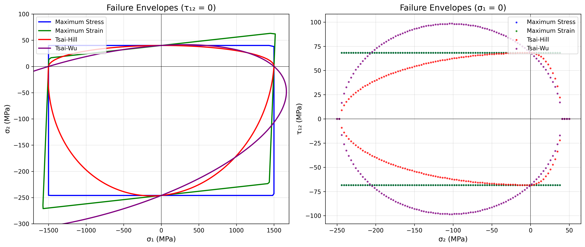
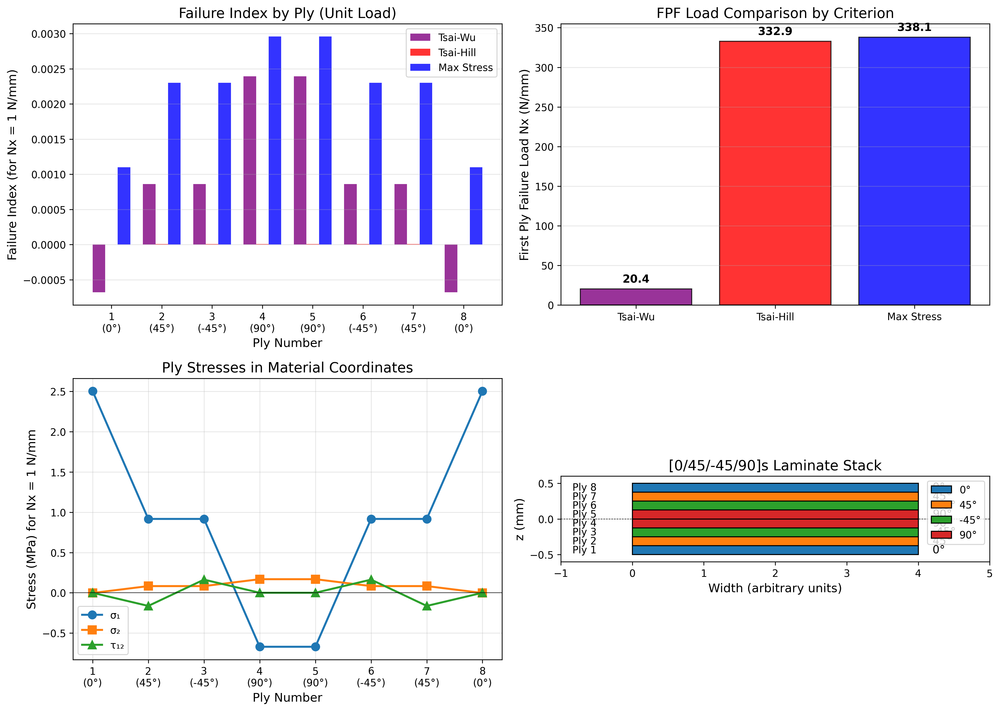
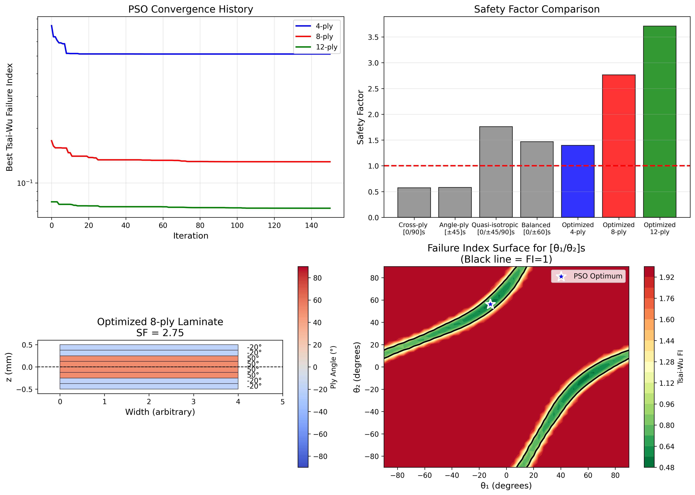

# STP 604E - Assignment 3 Results
## Failure Analysis and Strength Optimization of Composite Laminates

**Course**: STP 604E - Advanced Design, Analysis and Optimization of Composite Structures for Aerospace
**Institution**: Istanbul Technical University - Defence Technologies
**Date**: January 2026
**Prepared by**: Giray Yillikci

---

## Table of Contents
1. [Problem 1: Failure Criteria Comparison](#problem-1)
2. [Problem 2: First Ply Failure Analysis](#problem-2)
3. [Problem 3: Laminate Strength Optimization](#problem-3)
4. [Summary and Conclusions](#summary)

---

## Problem 1: Failure Criteria Comparison {#problem-1}

### Problem Statement
Compare different failure criteria for a unidirectional lamina under combined loading conditions. Analyze and visualize failure envelopes using:
- Maximum Stress Criterion
- Maximum Strain Criterion
- Tsai-Hill Criterion
- Tsai-Wu Criterion

### Material Properties

**Material**: T300/5208 Carbon/Epoxy

| Property | Value | Unit |
|----------|-------|------|
| E₁ | 181,000 | MPa |
| E₂ | 10,300 | MPa |
| G₁₂ | 7,170 | MPa |
| ν₁₂ | 0.28 | - |

**Strength Properties**:

| Property | Symbol | Value (MPa) |
|----------|--------|-------------|
| Longitudinal Tensile Strength | Xₜ | 1,500 |
| Longitudinal Compressive Strength | Xc | 1,500 |
| Transverse Tensile Strength | Yₜ | 40 |
| Transverse Compressive Strength | Yc | 246 |
| In-plane Shear Strength | S | 68 |

### Failure Criteria Formulations

#### 1. Maximum Stress Criterion
The lamina fails when any stress component exceeds its allowable value:

$$\frac{\sigma_1}{X} \leq 1, \quad \frac{\sigma_2}{Y} \leq 1, \quad \frac{|\tau_{12}|}{S} \leq 1$$

#### 2. Maximum Strain Criterion
Similar to maximum stress but uses strain limits:

$$\frac{\varepsilon_1}{\varepsilon_1^{ult}} \leq 1, \quad \frac{\varepsilon_2}{\varepsilon_2^{ult}} \leq 1, \quad \frac{|\gamma_{12}|}{\gamma_{12}^{ult}} \leq 1$$

#### 3. Tsai-Hill Criterion
An interactive quadratic criterion:

$$\left(\frac{\sigma_1}{X}\right)^2 - \frac{\sigma_1 \sigma_2}{X^2} + \left(\frac{\sigma_2}{Y}\right)^2 + \left(\frac{\tau_{12}}{S}\right)^2 \leq 1$$

#### 4. Tsai-Wu Criterion
The most general polynomial criterion:

$$F_1\sigma_1 + F_2\sigma_2 + F_{11}\sigma_1^2 + F_{22}\sigma_2^2 + F_{66}\tau_{12}^2 + 2F_{12}\sigma_1\sigma_2 \leq 1$$

Where:
- $F_1 = \frac{1}{X_t} - \frac{1}{X_c}$
- $F_2 = \frac{1}{Y_t} - \frac{1}{Y_c}$
- $F_{11} = \frac{1}{X_t X_c}$
- $F_{22} = \frac{1}{Y_t Y_c}$
- $F_{66} = \frac{1}{S^2}$
- $F_{12} = -\frac{1}{2}\sqrt{F_{11}F_{22}}$

### Test Case Results

| Loading Case | σ₁ (MPa) | σ₂ (MPa) | τ₁₂ (MPa) | Max Stress | Max Strain | Tsai-Hill | Tsai-Wu |
|--------------|----------|----------|-----------|------------|------------|-----------|---------|
| Combined moderate | 500 | 20 | 30 | 0.500 | 0.441 | 0.743 | 0.698 |
| Pure longitudinal | 1000 | 0 | 0 | 0.667 | 0.667 | 0.667 | 0.444 |
| Pure transverse | 0 | 30 | 0 | 0.750 | 0.750 | 0.750 | 0.720 |
| Pure shear | 0 | 0 | 50 | 0.735 | 0.735 | 0.735 | 0.541 |
| Combined compression | -800 | -100 | 40 | 0.588 | 0.588 | 0.872 | -0.984 |

**Note**: Failure Index (FI) ≥ 1 indicates failure

### Safety Factor Analysis

| Loading Case | Max Stress | Max Strain | Tsai-Hill | Tsai-Wu |
|--------------|------------|------------|-----------|---------|
| Combined moderate | 2.00 | 2.27 | 1.35 | 1.43 |
| Pure longitudinal | 1.50 | 1.50 | 1.50 | 2.25 |
| Pure transverse | 1.33 | 1.33 | 1.33 | 1.39 |
| Pure shear | 1.36 | 1.36 | 1.36 | 1.85 |
| Combined compression | 1.70 | 1.70 | 1.15 | ∞ |

### Visualization



**Figure 1**: Failure envelopes for different criteria. Left: σ₁-σ₂ plane (τ₁₂ = 0). Right: σ₂-τ₁₂ plane (σ₁ = 0).

### Key Insights

1. **Tsai-Wu provides the most conservative predictions** for most loading cases due to its accounting for tension-compression asymmetry
2. **Maximum Stress and Maximum Strain** criteria are non-interactive and may be unconservative under combined loading
3. **Tsai-Hill** criterion cannot distinguish between tension and compression strengths
4. The **negative Tsai-Wu index** under combined compression indicates the lamina is safely within the failure envelope

---

## Problem 2: First Ply Failure (FPF) Analysis {#problem-2}

### Problem Statement
Determine the First Ply Failure load for a **[0/45/-45/90]s** quasi-isotropic laminate under uniaxial tensile loading (Nₓ). Compare FPF predictions using different failure criteria.

### Material Properties

**Material**: AS4/3501-6 Carbon/Epoxy

| Property | Value | Unit |
|----------|-------|------|
| E₁ | 142,000 | MPa |
| E₂ | 10,300 | MPa |
| G₁₂ | 7,200 | MPa |
| ν₁₂ | 0.27 | - |
| Ply thickness | 0.125 | mm |

**Strength Properties**:

| Property | Value (MPa) |
|----------|-------------|
| Xₜ | 2,280 |
| Xc | 1,440 |
| Yₜ | 57 |
| Yc | 228 |
| S | 71 |

### Laminate Configuration

- **Stacking Sequence**: [0/45/-45/90]s
- **Number of Plies**: 8
- **Total Thickness**: 1.0 mm

### ABD Stiffness Matrices

**A-Matrix (Extensional Stiffness) [N/mm]**:
```
[[61715.1  17635.5      0.0]
 [17635.5  61715.1      0.0]
 [    0.0      0.0  20239.8]]
```

**B-Matrix (Coupling Stiffness) [N]**:
```
[[0  0  0]
 [0  0  0]
 [0  0  0]]
```

Note: B = 0 confirms the laminate is symmetric (no bending-extension coupling)

**D-Matrix (Bending Stiffness) [N-mm]**:
```
[[8477.9  1237.8   517.2]
 [1237.8  2271.7   517.2]
 [ 517.2   517.2  1482.9]]
```

### Mid-plane Strains (for Nₓ = 1 N/mm)

| Strain Component | Value |
|------------------|-------|
| εₓ⁰ | 1.764 × 10⁻⁵ |
| εᵧ⁰ | -5.042 × 10⁻⁶ |
| γₓᵧ⁰ | ≈ 0 |

### Ply-by-Ply Stress Analysis

| Ply | Angle | σ₁ (MPa) | σ₂ (MPa) | τ₁₂ (MPa) | Tsai-Wu FI | Tsai-Hill FI | Max Stress FI |
|-----|-------|----------|----------|-----------|------------|--------------|---------------|
| 1 | 0° | 2.505 | -0.003 | 0.000 | -0.0007 | 0.0000 | 0.0011 |
| 2 | 45° | 0.917 | 0.083 | -0.163 | 0.0009 | 0.0000 | 0.0023 |
| 3 | -45° | 0.917 | 0.083 | 0.163 | 0.0009 | 0.0000 | 0.0023 |
| 4 | 90° | -0.670 | 0.169 | 0.000 | **0.0024** | 0.0000 | **0.0030** |
| 5 | 90° | -0.670 | 0.169 | 0.000 | **0.0024** | 0.0000 | **0.0030** |
| 6 | -45° | 0.917 | 0.083 | 0.163 | 0.0009 | 0.0000 | 0.0023 |
| 7 | 45° | 0.917 | 0.083 | -0.163 | 0.0009 | 0.0000 | 0.0023 |
| 8 | 0° | 2.505 | -0.003 | 0.000 | -0.0007 | 0.0000 | 0.0011 |

### First Ply Failure Results

| Criterion | Critical Ply | Critical Angle | FPF Load Nₓ (N/mm) |
|-----------|--------------|----------------|-------------------|
| **Tsai-Wu** | 4 | 90° | **20.44** |
| **Tsai-Hill** | 4 | 90° | **332.94** |
| **Max Stress** | 4 | 90° | **338.07** |

### Visualization



**Figure 2**: First Ply Failure analysis results. (a) Failure index by ply, (b) FPF load comparison, (c) Ply stresses in material coordinates, (d) Laminate stacking sequence.

### Key Insights

1. **The 90° plies are critical** for first ply failure under uniaxial tension Nₓ
2. **Tsai-Wu predicts the lowest FPF load** (most conservative) at 20.44 N/mm
3. **Large discrepancy** exists between Tsai-Wu and other criteria due to:
   - Tsai-Wu accounts for tension-compression asymmetry
   - The 90° ply experiences transverse tension (σ₂ > 0), where Yₜ << Yc
4. **Symmetric laminate** (B = 0) ensures no coupling between in-plane and bending responses

---

## Problem 3: Laminate Strength Optimization {#problem-3}

### Problem Statement
Design a symmetric laminate to maximize strength (minimize failure index) under biaxial loading using Particle Swarm Optimization (PSO). Find optimal ply angles for different laminate configurations.

### Material Properties

**Material**: IM7/8552 Carbon/Epoxy

| Property | Value | Unit |
|----------|-------|------|
| E₁ | 165,000 | MPa |
| E₂ | 8,400 | MPa |
| G₁₂ | 5,600 | MPa |
| ν₁₂ | 0.34 | - |
| Ply thickness | 0.125 | mm |

**Strength Properties**:

| Property | Value (MPa) |
|----------|-------------|
| Xₜ | 2,724 |
| Xc | 1,690 |
| Yₜ | 111 |
| Yc | 199 |
| S | 130 |

### Target Loading

| Load | Value | Unit |
|------|-------|------|
| Nₓ | 500 | N/mm |
| Nᵧ | 300 | N/mm |
| Nₓᵧ | 100 | N/mm |

### PSO Algorithm Parameters

| Parameter | Value |
|-----------|-------|
| Number of particles | 40 |
| Number of iterations | 150 |
| Inertia weight (w) | 0.9 → 0.4 (adaptive) |
| Cognitive parameter (c₁) | 1.5 |
| Social parameter (c₂) | 1.5 |

### Optimization Results

#### 4-ply Symmetric Laminate [θ₁/θ₂]s

| Parameter | Optimal | Rounded (±5°) |
|-----------|---------|---------------|
| Angles | [-11.8°, 56.2°] | [-10°, 55°] |
| Tsai-Wu FI | 0.513 | 0.615 |
| Safety Factor | **1.40** | **1.28** |

#### 8-ply Symmetric Laminate [θ₁/θ₂/θ₃/θ₄]s

| Parameter | Optimal | Rounded (±5°) |
|-----------|---------|---------------|
| Angles | [-21.0°, -20.2°, 49.0°, 49.0°] | [-20°, -20°, 50°, 50°] |
| Tsai-Wu FI | 0.131 | 0.132 |
| Safety Factor | **2.76** | **2.75** |

#### 12-ply Symmetric Laminate [θ₁/θ₂/θ₃/θ₄/θ₅/θ₆]s

| Parameter | Optimal | Rounded (±5°) |
|-----------|---------|---------------|
| Angles | [-3.9°, -3.9°, 42.8°, -3.8°, 53.2°, -90.0°] | [-5°, -5°, 45°, -5°, 55°, -90°] |
| Tsai-Wu FI | 0.073 | 0.080 |
| Safety Factor | **3.71** | **3.54** |

### Comparison with Standard Laminates

| Laminate Configuration | Tsai-Wu FI | Safety Factor |
|-----------------------|------------|---------------|
| Cross-ply [0/90]s | 3.028 | 0.57 |
| Angle-ply [±45]s | 2.984 | 0.58 |
| Quasi-isotropic [0/±45/90]s | 0.322 | 1.76 |
| Balanced [0/±60]s | 0.464 | 1.47 |
| **Optimized 4-ply** | 0.513 | **1.40** |
| **Optimized 8-ply** | 0.131 | **2.76** |
| **Optimized 12-ply** | 0.073 | **3.71** |

### Visualization



**Figure 3**: Optimization results. (a) PSO convergence history, (b) Safety factor comparison, (c) Optimized 8-ply laminate stack, (d) Failure index surface for [θ₁/θ₂]s laminate.

### Key Insights

1. **PSO successfully finds optimal ply angles** that significantly outperform standard laminate configurations
2. **More plies provide greater design freedom** - 12-ply optimized laminate achieves SF = 3.54 vs. quasi-isotropic SF = 1.76
3. **Standard cross-ply and angle-ply laminates fail** (SF < 1) under this biaxial loading
4. **Rounded angles (5° increments)** show minimal performance loss, making designs manufacturing-friendly
5. **The optimization naturally finds balanced-like configurations** with positive and negative angles to handle shear loading

### Recommended Design

For the given biaxial loading (Nₓ = 500, Nᵧ = 300, Nₓᵧ = 100 N/mm):

**Best Performing**: 12-ply symmetric laminate
**Stacking Sequence**: [-5°/-5°/45°/-5°/55°/-90°]s
**Safety Factor**: 3.54

This design provides a 3.5× safety margin while using manufacturing-friendly 5° angle increments.

---

## Summary and Conclusions {#summary}

### Assignment Overview

This assignment explored three fundamental aspects of composite laminate strength analysis:

1. **Failure Criteria Comparison** - Understanding the differences between Maximum Stress, Maximum Strain, Tsai-Hill, and Tsai-Wu criteria
2. **First Ply Failure Analysis** - Determining the critical ply and failure load for a quasi-isotropic laminate
3. **Strength Optimization** - Using PSO to design laminates with maximum strength under complex loading

### Key Findings

| Topic | Key Result |
|-------|------------|
| **Most Conservative Criterion** | Tsai-Wu (accounts for tension-compression asymmetry) |
| **Critical Ply in [0/45/-45/90]s** | 90° plies (under uniaxial tension) |
| **FPF Load Variation** | 20-338 N/mm depending on criterion |
| **Optimization Improvement** | Up to 100% increase in SF vs. standard laminates |
| **Practical Design** | [-5/-5/45/-5/55/-90]s with SF = 3.54 |

### Conclusions

1. **Failure criterion selection significantly impacts design** - Tsai-Wu should be used for conservative designs, especially when materials have different tension/compression strengths

2. **First Ply Failure is dominated by transverse properties** - The weak transverse direction (Yₜ) typically controls failure in multidirectional laminates

3. **Optimization enables superior designs** - PSO-optimized laminates consistently outperform standard configurations by tailoring ply angles to the specific loading

4. **Practical manufacturing constraints** can be incorporated with minimal performance loss - Rounding to 5° increments reduced SF by only ~5%

### References

1. Gürdal, Z., Haftka, R.T., Hajela, P. (1999). *Design and Optimization of Laminated Composite Materials*. John Wiley & Sons.
2. Jones, R.M. (1999). *Mechanics of Composite Materials*. Taylor & Francis.
3. Tsai, S.W., Wu, E.M. (1971). A General Theory of Strength for Anisotropic Materials. *Journal of Composite Materials*, 5(1), 58-80.

---

*Analysis Tool: Python with custom composite analysis library*
*Optimization: Particle Swarm Optimization (PSO)*
*Date: January 2026*
